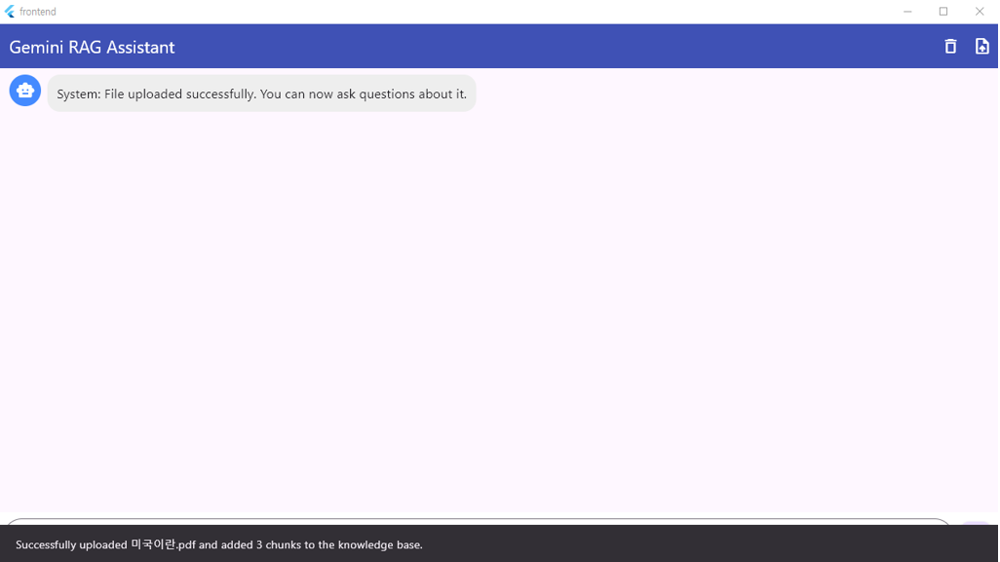

# RAG Chat

사용자가 AI 페르소나를 생성하고, 문서(PDF/텍스트/오디오)를 업로드한 뒤,
해당 문서를 기반으로 질의응답(Q&A)을 할 수 있는 RAG 채팅 애플리케이션입니다.

---

## Overview: 프로젝트 개요

### 기획 배경 및 목표

사용자가 직접 업로드한 문서들을 바탕으로 특색있는 페르소나를 지닌 챗봇과 대화할 수 있는 RAG 파이프라인을 구축했습니다. 단일 봇이 아닌 **페르소나 단위로 문서 컨텍스트를 격리**하여, 용도별 전문 AI를 만들 수 있는 풀스택 프로젝트입니다.

### 핵심 기능

| 기능 | 설명 |
|------|------|
| 페르소나 생성 | 사용자가 직접 AI 페르소나를 생성하고 문서 컨텍스트를 격리 |
| RAG 기반 대화 | 업로드된 문서를 벡터 검색하여 근거 있는 답변 생성 |
| SSE 스트리밍 | 토큰 단위 실시간 스트리밍으로 자연스러운 대화 경험 |
| 다중 세션 관리 | 페르소나마다 독립된 대화 세션을 여러 개 유지 |
| 문서 업로드 | PDF, TXT, MD, CSV, 오디오 파일 지원 (오디오는 STT 변환) |
| Google 로그인 | OAuth 2.0 기반 인증, JWT로 모든 API 보호 |
| 품질 모니터링 | RAG 검색 유사도를 자동 기록하고 리포트로 시각화 |

---

### 기술 스택

| 레이어 | 기술 |
|--------|------|
| Frontend | Flutter Desktop (Windows), Provider, Dio, Google Sign-In |
| Backend API | FastAPI, Uvicorn, SQLAlchemy, Pydantic, LangChain |
| LLM | Ollama (qwen3:8b), NVIDIA GPU 가속 |
| Embedding | BAAI/bge-m3 (1024차원), sentence-transformers |
| Vector DB | Qdrant (COSINE similarity) |
| Database | PostgreSQL 15 (대화 기록), Redis 7 (캐시) |
| Auth | Google OAuth 2.0, JWT (HS256) |
| Infra | Docker Compose, NVIDIA Container Toolkit, Nginx (프로덕션) |

### 시스템 상세 설명

- **프로젝트 문서**: [docs/portfolio.md](docs/portfolio.md)

---

## System Architecture

### 시스템 구성도

### 데이터 흐름도

**문서 업로드 파이프라인**

**실시간 질의 파이프라인**

---

## 앱 화면

---

## 라이선스

이 프로젝트는 학습 및 개인 프로젝트 목적으로 작성되었습니다.
